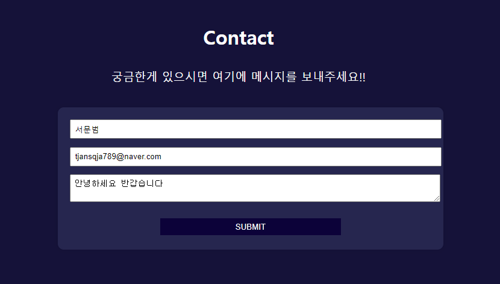
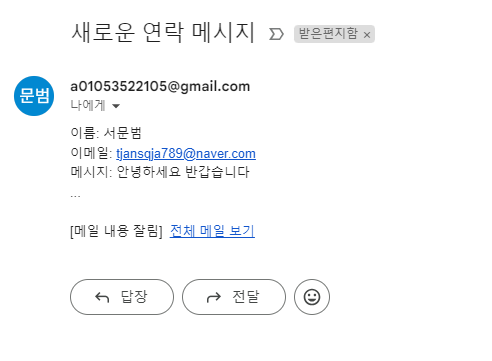

# Develop's Portfolio

---

## 1. 프로젝트 소개:

저의 프로젝트는 취업을 위한 개인 포트폴리오 사이트로, 제 경력, 프로젝트 경험 및 기술 스택을 간결하게 소개하고자 합니다.

---

## 2. 기술스택:

- HTML
- JavaScript
- CSS

---

## 3. 프로젝트 기능 및 배포 안내:

이 프로젝트는 GitHub 페이지를 통해 정적인 웹 페이지로 배포되고 있습니다. 주요 기능 중 하나인 Contact에서 사용자가 이름, 이메일, 그리고 메시지를 입력하고 "Submit" 버튼을 클릭하면 해당 정보가 나에게 이메일로 전송되는 기능입니다. 이를 통해 사용자는 손쉽게 연락을 취할 수 있고 쉽게 사용자로부터의 메시지를 수렴할 수 있습니다.

## https://github.com/moonbeom/portfolio

---
